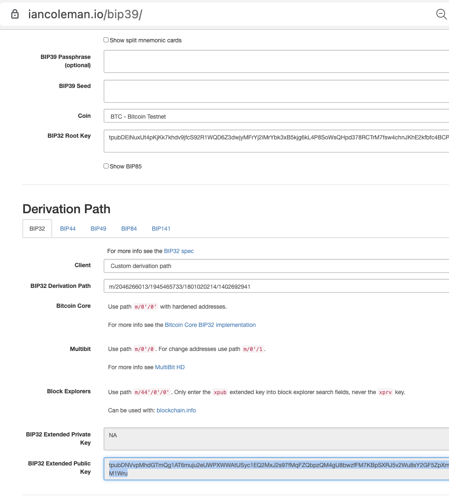
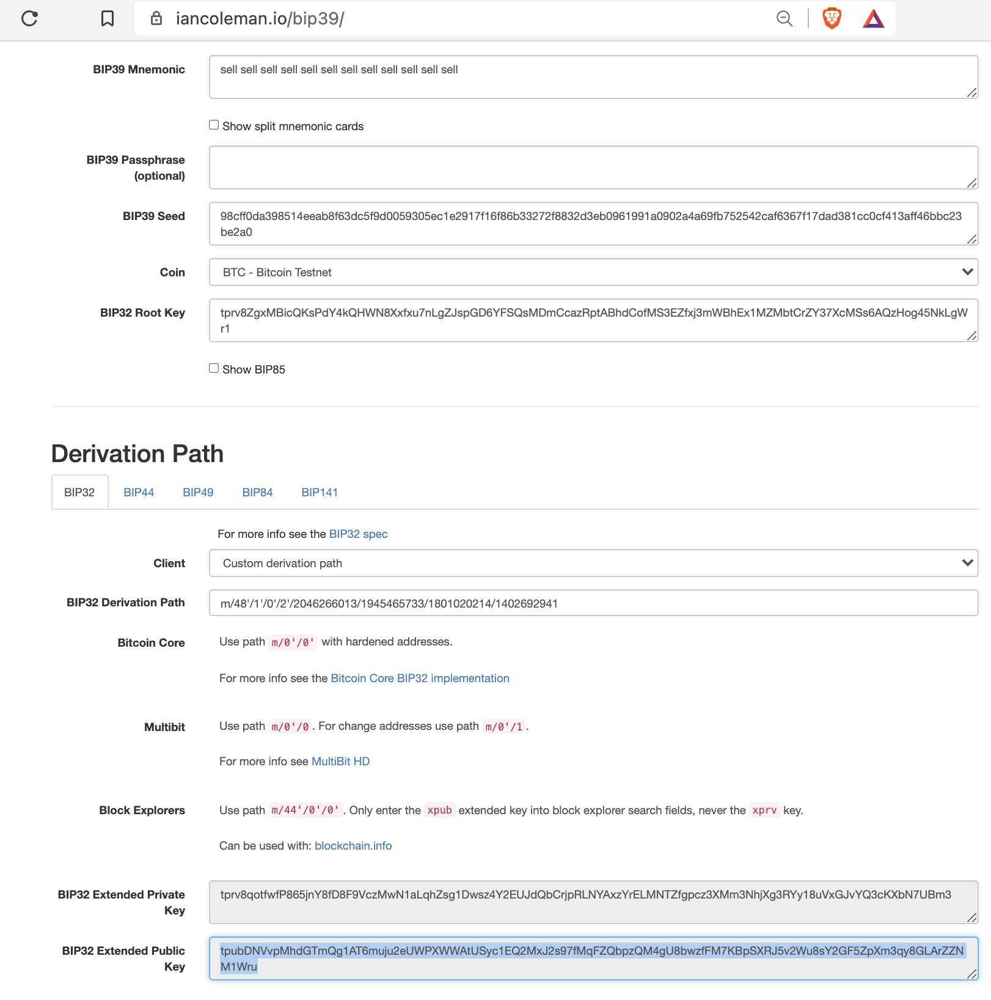
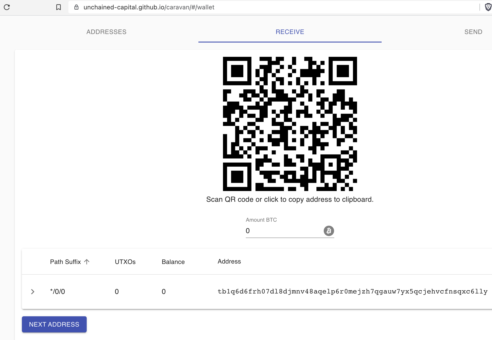
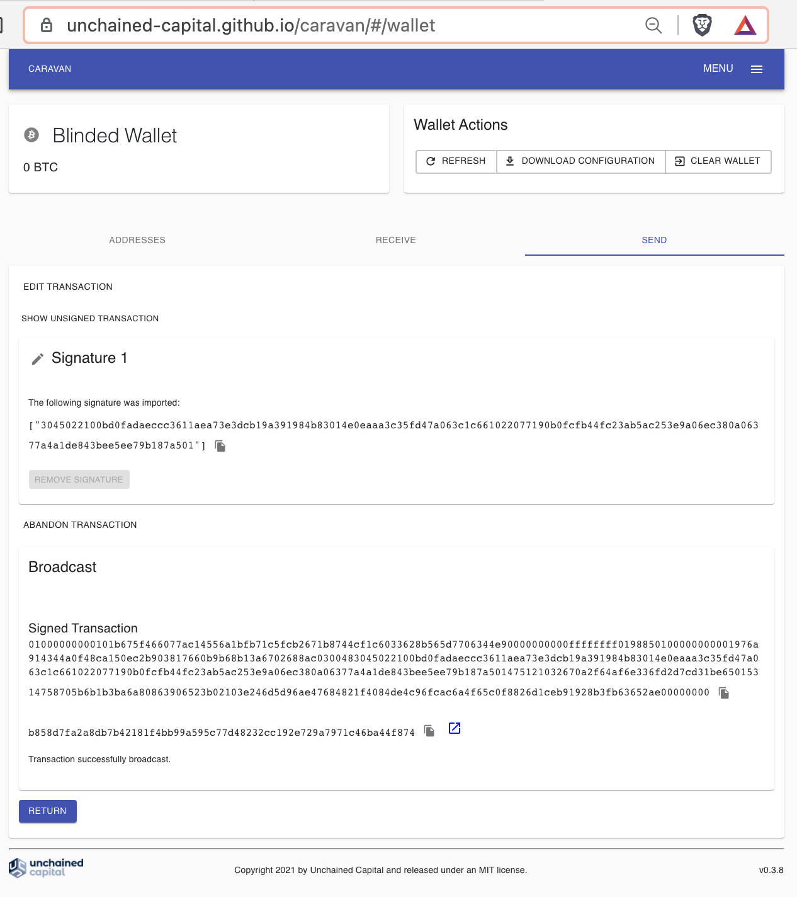
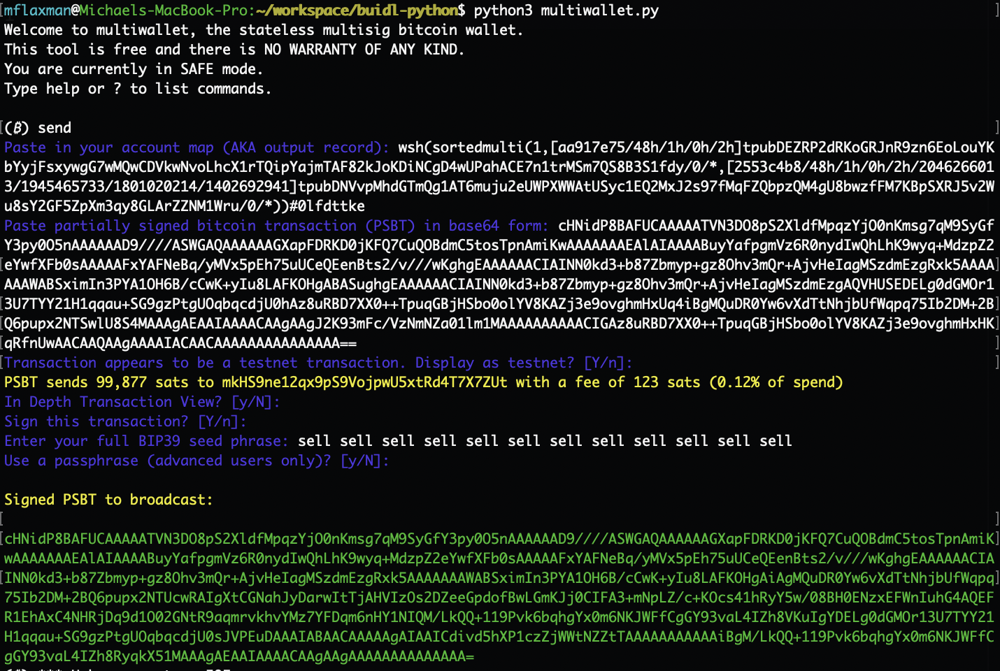
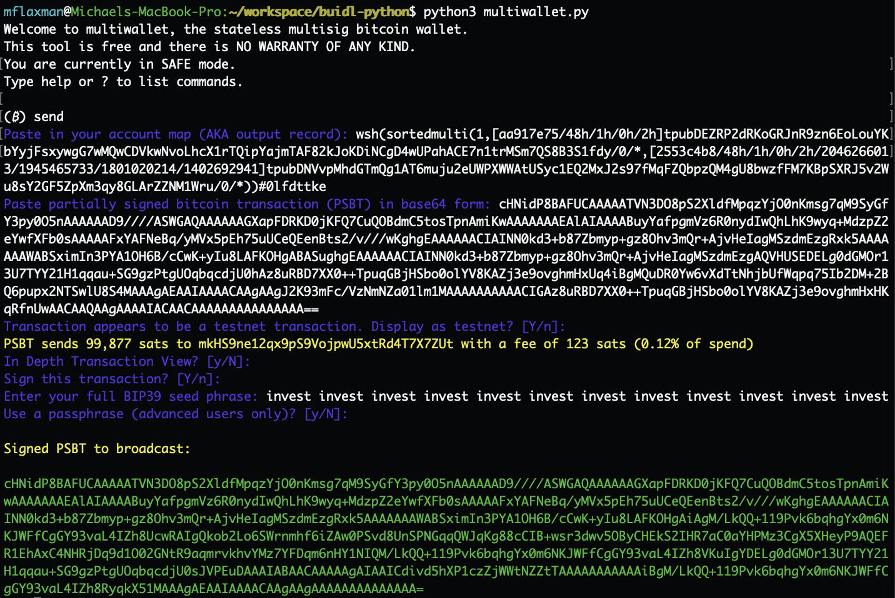

# Blinding A Seed Using Secret BIP32 Paths

## Table of Contents
* [Intro](#intro)
* [Walk-through](#walk-through)
  * [Generate 2 Seed Phrases](#generate-2-seed-phrases)
  * [Blind 1 Seed Phrase](#blind-1-seed-phrase)
  * [Create Output Descriptors (Account Map)](#create-output-descriptors)
  * [Get Receive Address](#get-receive-address)
  * [Sign Transaction](#sign-transaction)
  * [What We Accomplished](#what-we-accomplished)
* [Compatibility](#compatibility)
* [Blinding Multiple Seeds](#blinding-multiple-seeds)
* [Seed Phrase Reuse](#seed-phrase-reuse)
* [Comparison to Other Protocols](#comparison-to-other-protocols)
* [Backing Up Output Descriptors](#backing-up-output-descriptors)
* [References](#references)

## Intro
Bitcoin's multisig security model is a breakthrough in human ability to self-custody value.
By comparison, it is impossible to `3-of-5` your gold.
Multisig adoption has the power to reduce hacks/theft/loss in the bitcoin space by allowing users 1 (or more) catastrophic errors in their custody without putting any funds at risk.

However, multisig adoption currently suffer from a big problem: protecting your funds with `m-of-n` (i.e. `2-of-3`) seeds under current best practices means that there are now `n` locations where your privacy could be at risk.
While [Shamir's Secret Sharing Scheme is strictly inferior from a security perspective](https://btcguide.github.io/why-multisig-advanced#shamirs-secret-sharing-scheme), it does have the benefit that if someone gains access to `<m` shamir shares they learn *nothing* about what those Shamir Shares protect.

### Privacy Leakage

Standard/default BIP32 paths make it so that if a bad actor gets unauthorized access to a BIP39 seed phrase, they could scan the blockchain for spent pubkeys in redeem scripts to learn about what funds that seed protects and how many other seeds are needed for access.
For example, they might learn the following:
* The stolen seed phrase was party to a massive bitcoin transaction yesterday.
(Note that this is the case even if this seed phrase did not produce a signature in the transaction and was just sitting in cold storage).
* The transaction appears to have had a large change output sent back to itself, so this seed phrase is likely still actively being used to protect (at least) that much bitcoin.
* The transaction was a `2-of-3` of type `p2wsh`, so only 1 more seed phrase (along with the corresponding output descriptors) is needed to spend funds.
* This wallet engages in similiar transactions each Friday at ~4pm local time.

Even if the direct outcome of this privacy leak isn't used to rob someone, this information can be used in other nefarious ways:
* A government could subpoena a bank to look inside a safe deposit box to find a BIP39 seed phrase (say on a metal plate).
* A collaborative custodian (e.g. a lawyer, accountant, heir, close friend, "uncle Jim" bitcoiner, collaborative custody service, etc) could learn about your HODL and could share that information (by being hacked, a business decision, or being compelled by government).
* An eager heir could peak at their future inheritance.

### Solution

In this scheme, we demonstrate using a large and randomly generated BIP32 path to blind a BIP39 seed (or more specifically the corresponding xpub) in a multisig quorum.
If a bad actor gets unauthorized access to that BIP39 seed (and passphrase, if applicable), they learn *nothing* about what it protects.
This scheme enables 1 (or more) semi-trusted collaborative custodians to participate in a multisig quorum with *zero* knowledge of what they're protecting, and can make it far easier to achieve geographic/jurisdictional diversity.

This scheme is already live on bitcoin mainnet, is compatible with existing multisig hardware wallets and coordinator softwares (see [compatibility](#compatibility)), and has positive implications for privacy, recovery, and trust-minimized collaborative key-holders.

## Walk-through

For this demo, we'll use [Specter-Desktop](https://github.com/cryptoadvance/specter-desktop/) (powered by Bitcoin Core) as it's the de-facto standard for almost all new sovereign multisig users in 2021.
This should work for any Coordinator software that supports modern multisig standards ([ouput descriptors](https://github.com/bitcoin/bitcoin/blob/master/doc/descriptors.md) and [PSBTs](https://github.com/bitcoin/bips/blob/master/bip-0174.mediawiki)).
We'll also duplicate the code in [buidl](https://github.com/buidl-bitcoin/buidl-python) as it's a no-dependency FOSS bitcoin implementation that provides full support for every step of the blinding protocol.
For simplicity, we are going to blind just `1` seed phrase in a `1-of-2`, but it should be obvious how to expand this to a `2-of-3`, `3-of-5`, or any other quorum.
At the end, we'll discuss implications for blinding all `n` seed phrases.

### Buidl Setup for Verification (not required)
Easiest way to install and verify it's working:
```
$ pip3 install buidl && python3
>>> from buidl import *
```

<details>
  <summary>More secure way</summary>

Because `buidl` has no dependencies and is designed for airgap use, you don't actually need to install it:
```
$ git clone https://github.com/buidl-bitcoin/buidl-python.git && cd buidl-python && python3
>>> from buidl import *
```

</details>

These verification steps can be performed with other open-source libraries, so we'll call out to them below as well.

### Generate 2 Seed Phrases
Let’s assume that seed phrase A is held by (and generated by) me and seed B is held by (and generated by) a trusted-minimized third party (e.g. a lawyer, accountant, heir, close friend, "uncle Jim" bitcoiner, collaborative custody service, etc).

#### Seed Phrase A
```
BIP39 Seed Phrase (invest repeated 12x):
invest invest invest invest invest invest invest invest invest invest invest invest

Public Key Record (from hardware wallet):
[aa917e75/48h/1h/0h/2h]tpubDEZRP2dRKoGRJnR9zn6EoLouYKbYyjFsxywgG7wMQwCDVkwNvoLhcX1rTQipYajmTAF82kJoKDiNCgD4wUPahACE7n1trMSm7QS8B3S1fdy
```

#### Seed Phrase B
```
BIP39 Seed Phrase (sell repeated x12):
sell sell sell sell sell sell sell sell sell sell sell sell

Public Key Record (from hardware wallet):
[2553c4b8/48h/1h/0h/2h]tpubDEiNuxUt4pKjKk7khdv9jfcS92R1WQD6Z3dwjyMFrYj2iMrYbk3xB5kjg6kL4P8SoWsQHpd378RCTrM7fsw4chnJKhE2kfbfc4BCPkVh6g9
```

If you didn't know, these [are valid seed phrases](https://twitter.com/mflaxman/status/1386833296668102659) (though highly insecure).

<details>
  <summary>buidl verification</summary>

This could be generated in buidl as follows:
```
$ python3
>>> from buidl.hd import HDPrivateKey
>>> HDPrivateKey.from_mnemonic("invest " * 12, testnet=True).generate_p2wsh_key_record()
'[aa917e75/48h/1h/0h/2h]tpubDEZRP2dRKoGRJnR9zn6EoLouYKbYyjFsxywgG7wMQwCDVkwNvoLhcX1rTQipYajmTAF82kJoKDiNCgD4wUPahACE7n1trMSm7QS8B3S1fdy'
>>> HDPrivateKey.from_mnemonic("sell " * 12, testnet=True).generate_p2wsh_key_record()
'[2553c4b8/48h/1h/0h/2h]tpubDEiNuxUt4pKjKk7khdv9jfcS92R1WQD6Z3dwjyMFrYj2iMrYbk3xB5kjg6kL4P8SoWsQHpd378RCTrM7fsw4chnJKhE2kfbfc4BCPkVh6g9'
```

We ignore [SLIP132](https://github.com/satoshilabs/slips/blob/master/slip-0132.md) version byte encoding, but if your Coordinator software requires it then set `use_slip132_version_byte=True` in `buidl` or use [Jameson Lopp's convenient xpub converter](https://jlopp.github.io/xpub-converter/).

</details>


### Blind 1 Seed Phrase

Remember that Seed Phrase B is held by our trust-minimized third party.

We blind seed B's xpub using `buidl`'s built in [multiwallet.py](https://twitter.com/mflaxman/status/1321503036724989952).
We use the default entropy setting for a depth of 4 in our BIP32 path, or `(2^31)^4 ≈ 124 bits`.
This should make brute-forcing impossible.


*Confusing note: this run of the program is not what was used in these examples, see text below for the actual results.*

<details>
  <summary>(text version)</summary>

```
$ python3 multiwallet.py 
Welcome to multiwallet, the stateless multisig bitcoin wallet.
This tool is free and there is NO WARRANTY OF ANY KIND.
You are currently in SAFE mode.
Type help or ? to list commands.

(₿) advanced_mode
ADVANCED mode set, don't mess up!
(₿) blind_xpub
Enter an xpub key record to blind in the format [deadbeef/path]xpub (any path will do): [2553c4b8/48h/1h/0h/2h]tpubDEiNuxUt4pKjKk7khdv9jfcS92R1WQD6Z3dwjyMFrYj2iMrYbk3xB5kjg6kL4P8SoWsQHpd378RCTrM7fsw4chnJKhE2kfbfc4BCPkVh6g9
Use standard entropy parameters for blinding? [Y/n]: 
Generating BIP32 path with 124 bits of good entropy...
Here is a blinded xpub key record to upload to your Coordinator.
Create a multisig wallet with this blinded xpub and it will become a part of your account map (output descriptors).

[2553c4b8/48h/1h/0h/2h/2046266013/1945465733/1801020214/1402692941]tpubDNVvpMhdGTmQg1AT6muju2eUWPXWWAtUSyc1EQ2MxJ2s97fMqFZQbpzQM4gU8bwzfFM7KBpSXRJ5v2Wu8sY2GF5ZpXm3qy8GLArZZNM1Wru

Important notes:
  - Do NOT share this record with the holder of the seed phrase, or they will be able to unblind their key (potentially leaking privacy info about what it controls).
  - Possession of this blinded xpub key record has privacy implications, but it CANNOT alone be used to sign bitcoin transactions.
  - Possession of the original seed phrase (used to create the original xpub key record), CANNOT alone be used to sign bitcoin transactions.
  - In order to spend from this blinded xpub, you must have BOTH the seed phrase AND the blinded xpub key record (which will be included in your account map before you can receive funds).
```

</details>


<details>
  <summary>Ian Coleman BIP39 Verification</summary>

You can validate on this on an airgap computer using [Ian Coleman’s popular open-source tool](https://iancoleman.io/bip39/) and [Jameson Lopp's xpub converter for SLIP132 version byte encoding](https://jlopp.github.io/xpub-converter/).

#### Derivation path from xpub:



#### Derivation path from seed phrase:




</details>


### Create Output Descriptors

In our case, we take the regular seed phrase A xpub (see [Seed Phrase A](#Seed-Phrase-A) above) and the blinded Seed Phrase B xpub we just calculated (see [Blind 1 Seed Phrase](#Blind-1-Seed-Phrase) above) and combine them into a `1-of-2 p2wsh sortedmulti` output descriptor using Bitcoin Core (via Specter-Desktop):


That will also generate [this PDF backup of the output descriptors](investx12_sellx12_blinded_backup.pdf) (output descriptors only [here](account_map.png)).

TODO: add Specter-Desktop export here.


<details>
  <summary>buidl verification</summary>

We run the following code in python:
```
from buidl.descriptor import P2WSHSortedMulti

quorum_m = 1
key_records = [
    {
        # investx12 - regular path
        "xfp": "aa917e75",
        "path": "m/48h/1h/0h/2h",
        "xpub_parent": "tpubDEZRP2dRKoGRJnR9zn6EoLouYKbYyjFsxywgG7wMQwCDVkwNvoLhcX1rTQipYajmTAF82kJoKDiNCgD4wUPahACE7n1trMSm7QS8B3S1fdy",
        "account_index": 0,
    },
    {
        # sellx12 - BLINDED path
        "xfp": "2553c4b8",
        "path": "m/48h/1h/0h/2h/2046266013/1945465733/1801020214/1402692941",
        "xpub_parent": "tpubDNVvpMhdGTmQg1AT6muju2eUWPXWWAtUSyc1EQ2MxJ2s97fMqFZQbpzQM4gU8bwzfFM7KBpSXRJ5v2Wu8sY2GF5ZpXm3qy8GLArZZNM1Wru",
        "account_index": 0,
    },
]
p2wsh_sortedmulti_obj = P2WSHSortedMulti(quorum_m, key_records)
print(p2wsh_sortedmulti_obj)
```

Results:
```
wsh(sortedmulti(1,[aa917e75/48h/1h/0h/2h]tpubDEZRP2dRKoGRJnR9zn6EoLouYKbYyjFsxywgG7wMQwCDVkwNvoLhcX1rTQipYajmTAF82kJoKDiNCgD4wUPahACE7n1trMSm7QS8B3S1fdy/0/*,[2553c4b8/48h/1h/0h/2h/2046266013/1945465733/1801020214/1402692941]tpubDNVvpMhdGTmQg1AT6muju2eUWPXWWAtUSyc1EQ2MxJ2s97fMqFZQbpzQM4gU8bwzfFM7KBpSXRJ5v2Wu8sY2GF5ZpXm3qy8GLArZZNM1Wru/0/*))#0lfdttke
```

</details>


### Get Receive Address

#### Specter-Desktop

Bitcoin Core (via Specter-Desktop), provides the following address:


<details>
  <summary>buidl verification</summary>


```
>>> p2wsh_sortedmulti_obj.get_address(0)
'tb1q6d6frh07dl8djmnv48aqelp6r0mejzh7qgauw7yx5qcjehvcfnsqxc6lly'
```

</details>


<details>
  <summary>Caravan verification</summary>

While outside the scope of this demo, you can generate watch-only addresses with [Caravan](https://unchained-capital.github.io/caravan/) using [this wallet configuration file](bitcoin-1-of-2-P2WSH-testing.json) (derived from the output descriptors generated above):



</details>

<details>
  <summary>Sparrow verification</summary>

While outside the scope of this demo, you can generate watch-only addresses with [Sparrow](https://sparrowwallet.com/) using the output descriptors (the thing starting with `wsh(sortedmulti(...`, see [Create Output Descriptors](#create-output-descriptors) above):


</details>


#### Receive Bitcoin
Using a testnet faucet, we send some tBTC to this address:
<https://blockstream.info/testnet/tx/67eed0727a639f214b3da3ee206b2a27ed8cd8aca6ccd795972da5bc33dc4d35>

### Sign Transaction
To spend from this multisig, *both* of the following are required:
1. One seed phrase - can be either A or B
1. The complete output descriptors - this covers **all** seeds used in this multisig wallet, even if they're not used to co-sign the given transaction

We will return the funds to the testnet faucet address:

`mkHS9ne12qx9pS9VojpwU5xtRd4T7X7ZUt`

#### Prepare Transaction

Bitcoin Core (via Specter-Desktop) creates an unsigned PSBT to sweep these funds:


The corresponding PSBT it displays is (image version for airgap signers [here](psbt.png)):
```
cHNidP8BAFUCAAAAATVN3DO8pS2XldfMpqzYjO0nKmsg7qM9SyGfY3py0O5nAAAAAAD9////ASWGAQAAAAAAGXapFDRKD0jKFQ7CuQOBdmC5tosTpnAmiKwAAAAAAAEAlAIAAAABuyYafpgmVz6R0nydIwQhLhK9wyq+MdzpZ2eYwfXFb0sAAAAAFxYAFNeBq/yMVx5pEh75uUCeQEenBts2/v///wKghgEAAAAAACIAINN0kd3+b87Zbmyp+gz8Ohv3mQr+AjvHeIagMSzdmEzgRxk5AAAAAAAWABSximIn3PYA1OH6B/cCwK+yIu8LAFKOHgABASughgEAAAAAACIAINN0kd3+b87Zbmyp+gz8Ohv3mQr+AjvHeIagMSzdmEzgAQVHUSEDELg0dGMOr13U7TYY21H1qqau+SG9gzPtgUOqbqcdjU0hAz8uRBD7XX0++TpuqGBjHSbo0olYV8KAZj3e9ovghmHxUq4iBgMQuDR0Yw6vXdTtNhjbUfWqpq75Ib2DM+2BQ6pupx2NTSwlU8S4MAAAgAEAAIAAAACAAgAAgJ2K93mFc/VzNmNZa01lm1MAAAAAAAAAACIGAz8uRBD7XX0++TpuqGBjHSbo0olYV8KAZj3e9ovghmHxHKqRfnUwAACAAQAAgAAAAIACAACAAAAAAAAAAAAAAA==
```

<details>
  <summary>Caravan</summary>


If you designate the transaction as a "Coldcard", Caravan can interact with buidl (because Caravan's Coldcard implementation is PSBT under-the-hood).

Then, you can generate the transaction to sign using multiwallet ([text](psbt_from_caravan.txt) or [screenshot](psbt_from_caravan.png)) and relay this to your bitcoin node:




</details>


#### Sign Using Blinded Key

This can also be performed on Specter-DIY, or using any other PSBT-native hardware wallet that doesn't artifically restrict bip32 paths.



<details>
  <summary>(text version)</summary>

```
$ python3 multiwallet.py 
Welcome to multiwallet, the stateless multisig bitcoin wallet.
This tool is free and there is NO WARRANTY OF ANY KIND.
You are currently in SAFE mode.
Type help or ? to list commands.

(₿) send
Paste in your account map (AKA output record): wsh(sortedmulti(1,[aa917e75/48h/1h/0h/2h]tpubDEZRP2dRKoGRJnR9zn6EoLouYKbYyjFsxywgG7wMQwCDVkwNvoLhcX1rTQipYajmTAF82kJoKDiNCgD4wUPahACE7n1trMSm7QS8B3S1fdy/0/*,[2553c4b8/48h/1h/0h/2h/2046266013/1945465733/1801020214/1402692941]tpubDNVvpMhdGTmQg1AT6muju2eUWPXWWAtUSyc1EQ2MxJ2s97fMqFZQbpzQM4gU8bwzfFM7KBpSXRJ5v2Wu8sY2GF5ZpXm3qy8GLArZZNM1Wru/0/*))#0lfdttke
Paste partially signed bitcoin transaction (PSBT) in base64 form: cHNidP8BAFUCAAAAATVN3DO8pS2XldfMpqzYjO0nKmsg7qM9SyGfY3py0O5nAAAAAAD9////ASWGAQAAAAAAGXapFDRKD0jKFQ7CuQOBdmC5tosTpnAmiKwAAAAAAAEAlAIAAAABuyYafpgmVz6R0nydIwQhLhK9wyq+MdzpZ2eYwfXFb0sAAAAAFxYAFNeBq/yMVx5pEh75uUCeQEenBts2/v///wKghgEAAAAAACIAINN0kd3+b87Zbmyp+gz8Ohv3mQr+AjvHeIagMSzdmEzgRxk5AAAAAAAWABSximIn3PYA1OH6B/cCwK+yIu8LAFKOHgABASughgEAAAAAACIAINN0kd3+b87Zbmyp+gz8Ohv3mQr+AjvHeIagMSzdmEzgAQVHUSEDELg0dGMOr13U7TYY21H1qqau+SG9gzPtgUOqbqcdjU0hAz8uRBD7XX0++TpuqGBjHSbo0olYV8KAZj3e9ovghmHxUq4iBgMQuDR0Yw6vXdTtNhjbUfWqpq75Ib2DM+2BQ6pupx2NTSwlU8S4MAAAgAEAAIAAAACAAgAAgJ2K93mFc/VzNmNZa01lm1MAAAAAAAAAACIGAz8uRBD7XX0++TpuqGBjHSbo0olYV8KAZj3e9ovghmHxHKqRfnUwAACAAQAAgAAAAIACAACAAAAAAAAAAAAAAA==
Transaction appears to be a testnet transaction. Display as testnet? [Y/n]: 
PSBT sends 99,877 sats to mkHS9ne12qx9pS9VojpwU5xtRd4T7X7ZUt with a fee of 123 sats (0.12% of spend)
In Depth Transaction View? [y/N]: 
Sign this transaction? [Y/n]: 
Enter your full BIP39 seed phrase: sell sell sell sell sell sell sell sell sell sell sell sell
Use a passphrase (advanced users only)? [y/N]: 

Signed PSBT to broadcast:

cHNidP8BAFUCAAAAATVN3DO8pS2XldfMpqzYjO0nKmsg7qM9SyGfY3py0O5nAAAAAAD9////ASWGAQAAAAAAGXapFDRKD0jKFQ7CuQOBdmC5tosTpnAmiKwAAAAAAAEAlAIAAAABuyYafpgmVz6R0nydIwQhLhK9wyq+MdzpZ2eYwfXFb0sAAAAAFxYAFNeBq/yMVx5pEh75uUCeQEenBts2/v///wKghgEAAAAAACIAINN0kd3+b87Zbmyp+gz8Ohv3mQr+AjvHeIagMSzdmEzgRxk5AAAAAAAWABSximIn3PYA1OH6B/cCwK+yIu8LAFKOHgAiAgMQuDR0Yw6vXdTtNhjbUfWqpq75Ib2DM+2BQ6pupx2NTUcwRAIgXtCGNahJyDarwItTjAHVIzOs2DZeeGpdofBwLGmKJj0CIFA3+mNpLZ/c+KOcs41hRyY5w/08BH0ENzxEFWnIuhG4AQEFR1EhAxC4NHRjDq9d1O02GNtR9aqmrvkhvYMz7YFDqm6nHY1NIQM/LkQQ+119Pvk6bqhgYx0m6NKJWFfCgGY93vaL4IZh8VKuIgYDELg0dGMOr13U7TYY21H1qqau+SG9gzPtgUOqbqcdjU0sJVPEuDAAAIABAACAAAAAgAIAAICdivd5hXP1czZjWWtNZZtTAAAAAAAAAAAiBgM/LkQQ+119Pvk6bqhgYx0m6NKJWFfCgGY93vaL4IZh8RyqkX51MAAAgAEAAIAAAACAAgAAgAAAAAAAAAAAAAA=
```

</details>

This transaction was then broadcast on the testnet blockchain here: 
<https://blockstream.info/testnet/tx/1ae50b064c72ab0d71207693814519016755a89444f3d42ea4d32dad3b307536>

#### Sign Using Regular Key
This is standard, so we will only demonstrate it quickly with `multiwallet.py`.
You could use any good multisig hardware wallet with the BIP39 seed phrase `invest invest invest...` (x12).



<details>
  <summary>(text version)</summary>


```
$ python3 multiwallet.py 
Welcome to multiwallet, the stateless multisig bitcoin wallet.
This tool is free and there is NO WARRANTY OF ANY KIND.
You are currently in SAFE mode.
Type help or ? to list commands.

(₿) send
Paste in your account map (AKA output record): wsh(sortedmulti(1,[aa917e75/48h/1h/0h/2h]tpubDEZRP2dRKoGRJnR9zn6EoLouYKbYyjFsxywgG7wMQwCDVkwNvoLhcX1rTQipYajmTAF82kJoKDiNCgD4wUPahACE7n1trMSm7QS8B3S1fdy/0/*,[2553c4b8/48h/1h/0h/2h/2046266013/1945465733/1801020214/1402692941]tpubDNVvpMhdGTmQg1AT6muju2eUWPXWWAtUSyc1EQ2MxJ2s97fMqFZQbpzQM4gU8bwzfFM7KBpSXRJ5v2Wu8sY2GF5ZpXm3qy8GLArZZNM1Wru/0/*))#0lfdttke
Paste partially signed bitcoin transaction (PSBT) in base64 form: cHNidP8BAFUCAAAAATVN3DO8pS2XldfMpqzYjO0nKmsg7qM9SyGfY3py0O5nAAAAAAD9////ASWGAQAAAAAAGXapFDRKD0jKFQ7CuQOBdmC5tosTpnAmiKwAAAAAAAEAlAIAAAABuyYafpgmVz6R0nydIwQhLhK9wyq+MdzpZ2eYwfXFb0sAAAAAFxYAFNeBq/yMVx5pEh75uUCeQEenBts2/v///wKghgEAAAAAACIAINN0kd3+b87Zbmyp+gz8Ohv3mQr+AjvHeIagMSzdmEzgRxk5AAAAAAAWABSximIn3PYA1OH6B/cCwK+yIu8LAFKOHgABASughgEAAAAAACIAINN0kd3+b87Zbmyp+gz8Ohv3mQr+AjvHeIagMSzdmEzgAQVHUSEDELg0dGMOr13U7TYY21H1qqau+SG9gzPtgUOqbqcdjU0hAz8uRBD7XX0++TpuqGBjHSbo0olYV8KAZj3e9ovghmHxUq4iBgMQuDR0Yw6vXdTtNhjbUfWqpq75Ib2DM+2BQ6pupx2NTSwlU8S4MAAAgAEAAIAAAACAAgAAgJ2K93mFc/VzNmNZa01lm1MAAAAAAAAAACIGAz8uRBD7XX0++TpuqGBjHSbo0olYV8KAZj3e9ovghmHxHKqRfnUwAACAAQAAgAAAAIACAACAAAAAAAAAAAAAAA==
Transaction appears to be a testnet transaction. Display as testnet? [Y/n]: 
PSBT sends 99,877 sats to mkHS9ne12qx9pS9VojpwU5xtRd4T7X7ZUt with a fee of 123 sats (0.12% of spend)
In Depth Transaction View? [y/N]: 
Sign this transaction? [Y/n]: 
Enter your full BIP39 seed phrase: invest invest invest invest invest invest invest invest invest invest invest invest
Use a passphrase (advanced users only)? [y/N]: 

Signed PSBT to broadcast:

cHNidP8BAFUCAAAAATVN3DO8pS2XldfMpqzYjO0nKmsg7qM9SyGfY3py0O5nAAAAAAD9////ASWGAQAAAAAAGXapFDRKD0jKFQ7CuQOBdmC5tosTpnAmiKwAAAAAAAEAlAIAAAABuyYafpgmVz6R0nydIwQhLhK9wyq+MdzpZ2eYwfXFb0sAAAAAFxYAFNeBq/yMVx5pEh75uUCeQEenBts2/v///wKghgEAAAAAACIAINN0kd3+b87Zbmyp+gz8Ohv3mQr+AjvHeIagMSzdmEzgRxk5AAAAAAAWABSximIn3PYA1OH6B/cCwK+yIu8LAFKOHgAiAgM/LkQQ+119Pvk6bqhgYx0m6NKJWFfCgGY93vaL4IZh8UcwRAIgQkob2Lo6SWrnmhf6iZAw0PSvd8UnSPNGqqQWJqKg88cCIB+wsr3dwv5OByCHEkS2IHR7aC0aYHPMz3CgX5XHeyP9AQEFR1EhAxC4NHRjDq9d1O02GNtR9aqmrvkhvYMz7YFDqm6nHY1NIQM/LkQQ+119Pvk6bqhgYx0m6NKJWFfCgGY93vaL4IZh8VKuIgYDELg0dGMOr13U7TYY21H1qqau+SG9gzPtgUOqbqcdjU0sJVPEuDAAAIABAACAAAAAgAIAAICdivd5hXP1czZjWWtNZZtTAAAAAAAAAAAiBgM/LkQQ+119Pvk6bqhgYx0m6NKJWFfCgGY93vaL4IZh8RyqkX51MAAAgAEAAIAAAACAAgAAgAAAAAAAAAAAAAA=
```


</details>

### What We Accomplished

At the time of seed generation up until revealing the output descriptors (with secret BIP32 path), the holder of seed phrase B was unable to learn *anything* about what they were protecting:
* Transaction history (including any spent UTXOs) & balance
* Quorum information (`1-of-2` in this case)

If the HODLer of this seed phrase were malicious (or compelled by a government), they would not be able to reveal *any* privacy information.
Also, because this is built on top of existing BIP32 paths, it is *already* compatible with many existing wallet and coordinator libraries.

Of course, this scheme requires that the blinded key holder be able to get access to the output descriptors in the event they are needed for recovery.
Presumably, revealing this privacy information is well worth it to the original key-holder:
* If the original key-holder is still alive but has lost access to `m` seed phrases, this allows them to recover their bitcoin.
* If the original key-holder is now deceased, privacy is likely no longer their top concern (they just want the funds to make it to their heirs).

A common use-case here might be a `2-of-3` with the following criteria:
* Seed A belongs to the HODLer, who keeps it at home or work (along with copies of the output descriptors)
* Seed B belongs to the HODLer, who intentionally blinds it before putting the seed phrase in a safe deposit box.
The safe deposit box is setup to automatically transfer to the HODLer's estate (children) in the event something happens to them.
* Seed C is generated by the HODLer's estate (children), who is also given a copy of the output descriptors.

In this situation, if a banker drills the safe deposit box, they would be unable to tell what they gained access to (amount and/or quorum).

Of course this is just one construction out of nearly infinite possibilities.
Another might be to blind the heir's key (so that they don't know what they're inheriting) and give the output descriptors to a lawyer (who is bound by attorney-client privilege and also has **no private key material**).

### Compatibility

What's amazing about this protocol, is that because it takes advantage of existing standards (BIP32 and output descriptors) it already works on the bitcoin network!

#### Signers

| Name                  | Type       | Display Addresses  | Sign Standard Path | Sign Blinded Path |
|-----------------------|------------|--------------------|--------------------|-------------------|
| Specter-DIY           | Hardware   | :white_check_mark: | :white_check_mark: | :white_check_mark:|
| Sparrow               | Software   | :white_check_mark: | :white_check_mark: | :white_check_mark:|
| multiwallet.py        | Software   | :white_check_mark: | :white_check_mark: | :white_check_mark:|
| Keystone              | Hardware   | :white_check_mark: | :white_check_mark: | :x:               |
| BitBox02              | Hardware   | :white_check_mark: | :white_check_mark: | :x:               |
| Coldcard              | Hardware   | :warning:          | :warning:          | :warning:         |
| Trezor                | Hardware   | :grey_question:    | :grey_question:    | :grey_question:   |
| Passport              | Hardware   | :grey_question:    | :grey_question:    | :grey_question:   |
| Fully Noded / Gordian | Hardware   | :grey_question:    | :grey_question:    | :grey_question:   |

TODO: fill in the blanks and add others

Under regular use, Coldcard cannot import enhanced-privacy multisig wallets [for address validation](coldcard_import_fail.jpg) nor [sign a transaction](coldcard_import_fail.jpg) (even with a regular/unblinded seed).
However, if you disable essential safety checks (`Settings > Multisig Wallets > Skip Checks`), then it does technically work.

#### Coordinator Software

| Name             | Display Addresses     | Coordinate TX Signing        |
|------------------|-----------------------|------------------------------|
| Specter-Desktop  | :white_check_mark:    | :white_check_mark:           |
| Caravan          | :white_check_mark:    | :white_check_mark:           |
| Sparrow          | :white_check_mark:    | :white_check_mark:           |
| Fully Noded      | :grey_question:       | :grey_question:              |
| Nunchuk          | :grey_question:       | :grey_question:              |

TODO: fill in the blanks and add others

Note: to use Caravan for TX signing with PSBTs you must designate each Signer as a "Coldcard", since under-the-hood that is just the PSBT standard.

### Blinding Multiple Seeds

In the previous example, we were able to blind `1` xpub without trusting the hardware wallet and/or person generating the seed phrase to not peak/save the BIP32 path.
However, the same scheme could be applied to *every* seed phrase in our own quorum.

This means that if a bad actor gets unauthorized access to a single seed phrase (perhaps a single secure location is compromised), they learn *nothing* about what it protects nor what threshold is required for access.

Note, that we don't have to choose between blinding 1 and blinding all seeds, it is possible to mix and match.
Once users grok the blinding scheme they are likely to want to blind *all* of their seeds, but due to limited hardware wallet support may choose (for now) to blind only those seeds that are kept in less-secure locations or with parties whom privacy is a bigger issue (e.g. a collaborative custody service that already knows your output descriptors).

### Seed Phrase Reuse

It's important to note that in the case of using a trust-minimized third-party, that third-party could reuse the same seed phrase in nearly infinite trust-minimized setups.
To put this in practical terms, an "Uncle-Jim bitcoiner" might give out the same xpub to dozens of friends/family members who wish to include "Uncle Jim" in their multisig quorum for emergency recovery, while preserving privacy.
Since each blinded xpub has its own BIP32 path that is collision-resistant by design, there is theoretically no privacy leakage.
To be safe, the best practice might be for Uncle Jim to give out a different xpub to each recipient.

It would even be possible (though not required) for this seed phrase to be the very same one Uncle Jim uses to protect their personal bitcoin, meaning no new setup ceremony nor backup would be required for Uncle Jim to start protecting their friends and family's multisig.
Relying more heavily on one system might further incentivize Uncle Jim to improve his own seed phrase security, perhaps by using a better entropy source, a more durable metal plate backup, potentially including a passphrase, and/or using a protocol like [SLIP39](https://github.com/satoshilabs/slips/blob/master/slip-0039.md).

### Emergency/Recovery Keys

Multisig's killer feature (adding redundancy and eliminating single points of failure) is heavily reduced if private key material is stored in the same physical location.
For example, a `2-of-3` multisig where `2` seed phrases are kept at home is problematic.
While `4-of-7` multisig sounds great in theory, how many people have access to `7` locations with around the clock security?
The problem is even harder if you want geographic redundancy to protect against natural disasters (a fire, flood, or tornado leading to evacuation).

By using this scheme, you can choose to delegate some trust to explicit third parties (perhaps even in other geographies) by giving them keys designed to only ever be used for recovery.
Under normal circumstances, they never sign a transaction nor even see your output descriptors.
In an emergency recovery situation (you lose `1` or more seeds and/or are hit by a bus), these collaborative custodians can co-sign if supplied the output descriptors (destroying your privacy).
Losing some privacy only if it leads to recovery of your otherwise lost funds would be a compelling proposition for many bitcoiners.

## Backing Up Output Descriptors

Backing up output descriptors is a new problem that multisig introduces.
Most new users don't realize that spending from a multisig wallet requires access to not only `m-of-n` but also the output descriptors (public key information) for this collection of seeds.
Under current best practices, output descriptors can easily be regenerated from all `n` seed phrases, but it is impossible to regenerate output descriptors from `n-1` seed phrases.

This means that if a user stores their funds in a `3-of-5` multisig wallet and loses only `1` seed (meaning that they still have acccess to the other `4` seed phrases), the only way they can spend the associated funds is if they have a copy of their output descriptors.
For this reason, **backups of output descriptors are essential!**

There are two problems with these backups:
1. It reveals all of your transaction history to anyone who comes across it.
1. It is generally far too large to etch into metal (and would be difficult to transcribe).

### Deterministic Paths

One problem of this proposal so far is that if you lost your output descriptors yet still had access to **all** `n` seeds, you would still be unable to regenerate the output descriptors needed to access your funds.
However, if you have regular/unblinded paths, then recovery of all `n` seeds would be sufficient to deterministically regenerate your output descriptors.

The current best practices are to backup your output descriptors with each seed, but let's assume that a HODLer doesn't do that, or over a long enough time perhaps the digital media and/or paper they used failed.
One creative idea from [@stepansnigirev](https://github.com/stepansnigirev) is to feed data from the seeds into a pseudo-random function and use that output to encode bip32 paths.
Because the algorithm is deterministic, it would be possible to use that data to regenerate the output descriptors with all `n` seeds.
Note that if you lose your output descriptors and have `n-1` seeds (say `4-of-5` seeds in a `3-of-5` multisig) that is still **not sufficient** to regnerate your output descriptors.

A simple version of the deterministic algorithm for a 2-of-3 might be something like:
```
hash_digest = sha256("2 xpub_A xpub_B xpub_C")
bip32_path = deterministic_path_from_entropy(hash_digest)
```

See [here](https://github.com/mflaxman/blind-xpub/blob/deterministic-paths/deterministic_paths.py) for a more complex working version that includes some more advanced features:
1. Lexographic sorting of xpubs (not just `sortedmulti` at the child pubkey level, but sorting the parent xpubs to always produce the same output)
1. Ability to easily recover bip32 paths (and thus full output descriptors) even if you forget your quorum threshold (`m`) and/or which of your xpubs you blinded.
1. Deterministically unique and unlinkable bip32 paths for each blinded xpub, so that publishing a bip32 path for 1 xpub does not leak any info to other xpubs.
1. An optional user-passphrase feature, which feeds extra entropy into the PRF, creating unlimited decoy multisig wallets.
This feature would be strictly **experts only**.

This proposal has the added benefit of statelessly blocking any bip32 path coordinator ransom attacks.

### SSSS for Output Descriptors

Regardless of whether this blinding proposal is implemented widely (with or without the above deterministic paths), Shamir's Secret Sharing scheme for output descriptors would be a welcome addition to multisig standards as well.

For example, assume:
1. HODLer encrypts the output descriptors, and uses Shamir's Secret Sharing Scheme to divide the decryption key used into `2-of-n` parts (arbitrary but useful threshold).
1. Each of `n` secure locations has: `1` unique seed phrase (perhaps etched in metal), `1` unique Shamir Share, and a copy of the same encrypted output descriptors

Note that the encrypted output descriptors could be kept redundantly in *many* less secure locations (perhaps even cloud storage), as `2` shamir shares are needed to decrypt the output descriptors (and it alone cannot be used to spend funds).

Then, as long as you are able to access `2` secure locations, you can recover your output descriptors.
It would then be possible to have something like a `3-of-5` on-chain `p2wsh` multisig, where `2-of-5` Shamir Shards are needed to recover the decryption key and recover the output descriptors.

If that were to happen it would be very good for existing multisig setups, and also it would work excellently with these hidden bip32 paths.

## Comparison to Other Protocols

How does this compare to existing options?

### Versus Regular/Traditional/Unblinded Seeds
While this protocol provides strong privacy guarantees, is it worth it?
Regular (unblinded) seeds have some advantages:
* Complexity is the enemy of security.
Counterpoint: the biggest form of complexity is backup up the output descriptors, which is already the best practice for multisig.
* Greater hardware wallet support.
Counterpoint: I hope all hardware wallets will support enhanced privacy in the future.
* If you don't keep a copy of the output descriptors, but still have all `n` seed phrases, you can still recover your funds.
Counterpoint: you should never lose your output descriptors, as they should be backed up in many places.
Update: **[the deterministic paths version of this protocol](#deterministic-paths) eliminates this concern!**

### Versus Secret BIP39 Passphrases
Another way to accomplish the same goal would be to [use a unique passphrase for each BIP39 seed](https://github.com/BlockchainCommons/Airgapped-Wallet-Community/discussions/37) and not store that passphrase with the BIP39 seed (keep it stored somewhere else).
I argue that using BIP32 paths is *strictly superior*.
* Most hardware wallets have bad input devices (no keyboard), so typing a long passphrases at setup/use is quite challenging.
The passphrase is also required to "unlock" the HWW, vs just using an existing mechanism (output descriptors) to transfer unlocking data to the HWW.
In this case of QR-based wallets, this unlocking is currently a magical UX; all you need to do is scan the Output Descriptors and your hardware wallet is ready to go.
* These unique passphrases must be stored somewhere.
Of course, this could just be at the coordinator, but there is currently no mechanism/standard for how to do that (unlike BIP32 paths).
* Requires visiting cold storage for re-use.
For an "Uncle Jim" bitcoiner to participate in many different friends or family member multisig wallets, he must visit his cold storage and enter a unique passphrase before giving out an xpub to each participant.
* If you want to use a regular BIP39 passphrase in addition to a blinding passphrase, that becomes complex.
You would probably just do something like append the regular passphrase to the end of the blinding passphrase, but this is messy (was there a separation character?).
* Humans are terrible at generating passphrases.
While it would always be possible to have good software generate the passphrase, that would be confusing as passwords are typically user-supplied.
* From the author of [the original passphrase-based proposal](https://github.com/BlockchainCommons/Airgapped-Wallet-Community/discussions/37#discussioncomment-627710): "I like your privacy proposal (using long unpredictable BIP32 path) better than mine (using BIP39 passwords)."

### Versus Taproot

TODO: confirm accuracy of this section.

Taproot offers compelling privacy, transaction fee, and complex script template advantages.
That said, if past upgrades are any indication, vendor adoption is going to take a **very** long time (especially for multisig which still has limited support from hardware wallets and tends to get the least updates/attention).

Because taproot allows for *much* larger scripts (while keeping fees affordable), we could see a big increase in the number of co-signers/locations used.
For example, you could have:
* A multisig that degrades from a `4-of-7` to `3-of-7`, then `2-of-7`, and finally `1-of-7`, with each degradation taking place every `5` years.
* Combinations where you and your family hold seeds with different weighting: `2` of your own seeds are needed to spend funds, but `2` of your family's seeds have the same weighting as `1` of your seeds.

Taproot also uses output descriptors to describe addresses, so you're facing a very similar privacy problem if you store output descriptors with each seed phrase (recommended) and 1 of your secure locations is compromised.
As taproot is designed to be compatible with ECDSA private keys (and thus BIP39), this same scheme should play nicely with future taproot multisig standards as they emerge.

## References
* [Blockchain commons thread on nosy signatories](https://github.com/BlockchainCommons/Airgapped-Wallet-Community/discussions/37)
* [Original tweet-storm with the idea for this](https://twitter.com/mflaxman/status/1329535324607885324)

Thank you to Stepan Snigirev, Clark Moody, Jimmy Song, Christopher Allen, Buck Perley, SeedSigner, and others for providing me with feedback on various iterations of this proposal.
More feedback is welcomed.
