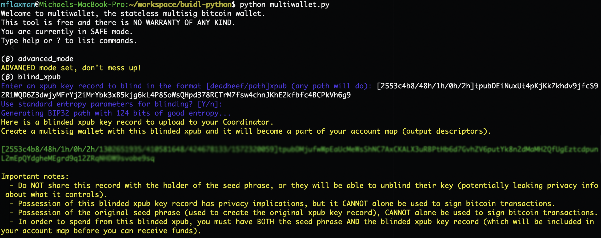
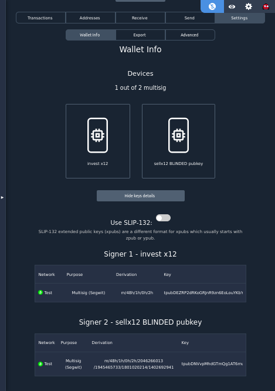
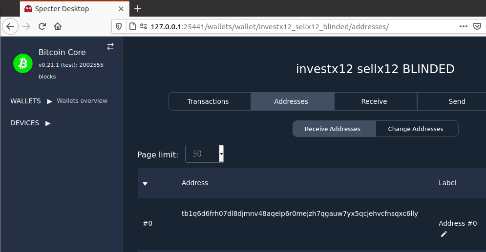
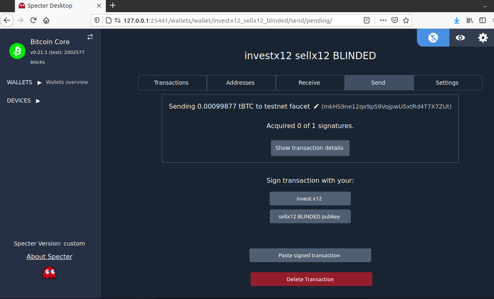

# Blinding A Seed Using Secret BIP32 Paths

## Table of Contents
* [Intro](#intro)
* [Tech Overview](#tech-overview)
* [Generate 2 Seed Phrases](#generate-2-seed-phrases)
* [Blind 1 Seed Phrase](#blind-1-seed-phrase)
* [Create Account Map](#create-account-map)
* [Get Receive Address](#get-receive-address)
* [Sign Transaction](#sign-transaction)
* [What We Accomplished](#what-we-accomplished)
* [Compatibility](#compatibility)
* [First Party Blinding](#first-party-blinding)
* [Seed Phrase Reuse](#seed-phrase-reuse)
* [Versus Passphrase](#vs-passphrase)
* [References](#references)

## Intro
Bitcoin's multisig security model is a breakthrough in human ability to self-custody value.
By comparison, it is impossible to `3-of-5` your gold.
Multisig adoption has the power to reduce hacks/theft/loss in the bitcoin space by allowing users to make 1 (or more) catastrophic mistakes in their custody without putting funds at risk.

However, multisig adoption currently suffer from two big problems: securing multiple locations and privacy leakage (at those locations).

#### Securing Multiple Locations

While `4-of-7` multisig sounds great in theory, how many people have access to `7` locations with around the clock security?
The problem is even harder if you want geographic redundancy to protect against natural disasters (a fire, flood, or tornado leading to evacuation).

Multisig's killer feature (adding redundancy and eliminating single points of failure) is heavily reduced if private key material is stored in the same physical location.
For example, a `2-of-3` multisig where `2` seed phrases are kept at home is not ideal.

#### Privacy Leakage

Standard/default BIP32 paths make it so that if a bad actor gets unauthorized access to a BIP39 seed phrase (or corresponding xpub), they could learn about what funds it protects and how.
For example, by scanning the blockchain for spent pubkeys in redeem scripts they might learn the following:
* That seed phrase was party to a massive transaction yesterday that (likely) had a large change ouput (note that this is the case even if this seed phrase did not produce a signature in the transaction and was just sitting in cold storage).
* The transaction was a `2-of-3` and likely had large change output sent back to itself. This means that only 1 more seed phrase (along with the account map) is needed to spend funds.
* It might also be possible to know that this entity engages in similiar transactions each Friday at ~4pm local time.

_Potential outcome: show up at this person's house or place of business with a $5 wrench._

Even if the direct outcome of this privacy leak isn't used to rob someone, this information can be used in other nefarious ways:
* A government could subpoena a bank to look inside a safe deposit box to find a BIP39 seed phrase (say on a metal plate).
* A collaborative custodian (e.g. a lawyer, accountant, heir, close friend, "uncle Jim" bitcoiner, collaborative custody service, etc) could learn about your HODL and could share that information (either by business decision or government mandate).
* An interested heir could peak at their future inheritance.

### Solution

In this scheme, we demonstrate using a large and randomly generated BIP32 path to blind a BIP39 seed (or more specifically the corresponding xpub) in a multisig quorum.
If a bad actor gets unauthorized access to that BIP39 seed (and passphrase, if applicable), they learn *nothing* about what it protects.
This scheme enables 1 (or more) semi-trusted collaborative custodians (e.g. a lawyer, accountant, heir, close friend, "uncle Jim" bitcoiner, collaborative custody service, etc) to participate in a multisig quorum with *zero* knowledge of what they're protecting, and can supply geographic/jurisdictional diversity.

We demonstrate that this proposal is already live on bitcoin mainnet, is compatible with existing multisig hardware wallets, and has positive implications for both privacy and trust-minimized collaborative key-holders.

## Tech Overview

For this demo, we'll use [Specter-Desktop](https://github.com/cryptoadvance/specter-desktop/) (powered by Bitcoin Core) as it's the de-facto standard for almost all new sovereign multisig users today.
This should work for any Coordinator software that supports modern multisig standards ([account maps](https://github.com/bitcoin/bitcoin/blob/master/doc/descriptors.md) and [PSBTs](https://github.com/bitcoin/bips/blob/master/bip-0174.mediawiki)).
We'll also duplicate the code in [buidl](https://github.com/buidl-bitcoin/buidl-python) as it's a no-dependency FOSS bitcoin implementation that provides full support for every step of the blinding protocol.
For simplicity, we are going to blind just `1` seed phrase in a `1-of-2`, but it should be obvious how to expand this to a `2-of-3`, `3-of-5`, or any other quorum.
At the end, we'll discuss implications for blinding all `m` seed phrases.

## Buidl Setup for Verification (not required)
Easiest way (this should not throw an error):
```
$ pip3 install buidl && python3
>>> from buidl import *
```

More secure way (this should not throw an error):
```
$ git clone https://github.com/buidl-bitcoin/buidl-python.git && cd buidl-python && python3
>>> from buidl import *
```
(because `buidl` has no dependencies and is designed for airgap use, you don't actually need to install it)


These verification steps can be performed with other open-source libraries, so we'll call out to them below as well.

## Generate 2 Seed Phrases
Let’s assume that seed phrase A is held by (and generated by) me and seed B is held by (and generated by) a trusted-minimized third party (e.g. a lawyer, accountant, heir, close friend, "uncle Jim" bitcoiner, collaborative custody service, etc).

If you didn't know, the below [are valid seed phrases](https://twitter.com/mflaxman/status/1386833296668102659) (though highly insecure).

### Seed Phrase A
```
BIP39 Seed Phrase (invest repeated 12x):
invest invest invest invest invest invest invest invest invest invest invest invest

Public Key Record (from hardware wallet) in SLIP132 encoding:
[aa917e75/48h/1h/0h/2h]Vpub5mRMNhCLt7nNky1SpXzt1KdLb4FGKTTQuPxcG3MygnWyGTD87fYmK4tfyfgLahhb5SYanobvk1Zis676QSsGMjVQ9xz9QQcYsizJDq1xzxT

Public Key Record (from hardware wallet) in regular encoding:
[aa917e75/48h/1h/0h/2h]tpubDEZRP2dRKoGRJnR9zn6EoLouYKbYyjFsxywgG7wMQwCDVkwNvoLhcX1rTQipYajmTAF82kJoKDiNCgD4wUPahACE7n1trMSm7QS8B3S1fdy
```

### Seed Phrase B
```
BIP39 Seed Phrase (sell repeated x12):
sell sell sell sell sell sell sell sell sell sell sell sell

Public Key Record (from hardware wallet) in SLIP132 encoding:
[2553c4b8/48h/1h/0h/2h]Vpub5maJud3od8qgmvi3XPpnweRsBm4ir8QdVTesjtmt8Q3nV48HncG1sddZCMhr6W6GRoAs3svAXvGZ8GF98rQkHH5UMtCHJimTNNjNSWZUapk

Public Key Record (from hardware wallet) in regular encoding:
[2553c4b8/48h/1h/0h/2h]tpubDEiNuxUt4pKjKk7khdv9jfcS92R1WQD6Z3dwjyMFrYj2iMrYbk3xB5kjg6kL4P8SoWsQHpd378RCTrM7fsw4chnJKhE2kfbfc4BCPkVh6g9
```

### Buidl Verification

This could be generated in buidl as follows:
```
$ python3
>>> from buidl.hd import HDPrivateKey
>>> HDPrivateKey.from_mnemonic("invest " * 12, testnet=True).generate_p2wsh_key_record()
'[aa917e75/48h/1h/0h/2h]Vpub5mRMNhCLt7nNky1SpXzt1KdLb4FGKTTQuPxcG3MygnWyGTD87fYmK4tfyfgLahhb5SYanobvk1Zis676QSsGMjVQ9xz9QQcYsizJDq1xzxT'
>>> HDPrivateKey.from_mnemonic("sell " * 12, testnet=True).generate_p2wsh_key_record()
'[2553c4b8/48h/1h/0h/2h]Vpub5maJud3od8qgmvi3XPpnweRsBm4ir8QdVTesjtmt8Q3nV48HncG1sddZCMhr6W6GRoAs3svAXvGZ8GF98rQkHH5UMtCHJimTNNjNSWZUapk'
```

Note that we use [SLIP132](https://github.com/satoshilabs/slips/blob/master/slip-0132.md) version byte encoding to communicate unambiguously that we are `p2wsh` on testnet, but if you/your Coordinator software is smart then regular xpub/tpub can work great as well.
`buidl` supports both (set `use_slip132_version_byte=False`), and [Jameson Lopp's convenient xpub converter](https://jlopp.github.io/xpub-converter/) can also convert for you if needed.

## Blind 1 Seed Phrase

Remember that Seed Phrase B is held by our trust-minimized third party.

We blind seed B's xpub using `buidl`'s built in [multiwallet.py](https://twitter.com/mflaxman/status/1321503036724989952).
We use the default, which is 124 bits of entropy from a CSPRNG.
This should make brute-forcing impossible.
A depth of 4 in our BIP32 path gives us `124` bits: `~(2^31)^4`

```
$ python3 multiwallet.py 
Welcome to multiwallet, the stateless multisig bitcoin wallet.
This tool is free and there is NO WARRANTY OF ANY KIND.
You are currently in SAFE mode.
Type help or ? to list commands.

(₿) advanced_mode
ADVANCED mode set, don't mess up!
(₿) blind_xpub
Enter an xpub key record to blind in the format [deadbeef/path]xpub (any path will do): [2553c4b8/48h/1h/0h/2h]Vpub5maJud3od8qgmvi3XPpnweRsBm4ir8QdVTesjtmt8Q3nV48HncG1sddZCMhr6W6GRoAs3svAXvGZ8GF98rQkHH5UMtCHJimTNNjNSWZUapk
Use standard entropy parameters for blinding? [Y/n]: 
Generating BIP32 path with 124 bits of good entropy...
Here is a blinded xpub key record to upload to your Coordinator.
Create a multisig wallet with this blinded xpub and it will become a part of your account map (output descriptors).

[2553c4b8/48h/1h/0h/2h/2046266013/1945465733/1801020214/1402692941]Vpub5uMrp2GYpnHN8BkjvXpP71TuZ8BDqu61PPcwEKSzE9Mcuow727mUJNsDsKdzAiupHXea5F7ZxD9SaSQvbr1hvpNjrijJQ2J46VQjc5yEcm8

Important notes:
  - Do NOT share this record with the holder of the seed phrase, or they will be able to unblind their key (potentially leaking privacy info about what it controls).
  - Possession of this blinded xpub key record has privacy implications, but it CANNOT alone be used to sign bitcoin transactions.
  - Possession of the original seed phrase (used to create the original xpub key record), CANNOT alone be used to sign bitcoin transactions.
  - In order to spend from this blinded xpub, you must have BOTH the seed phrase AND the blinded xpub key record (which will be included in your account map before you can receive funds).
```

This looks better when formatted with nice colors in the CLI app:


### Verification

You can validate on this on an airgap computer using [Ian Coleman’s popular open-source tool](https://iancoleman.io/bip39/) and [Jameson Lopp's xpub converter for SLIP132 version byte encoding](https://jlopp.github.io/xpub-converter/).
[Here is a screenshot of proving accuracy of this derivation path from the xpub](blinding_from_vpub.png), and [here is a screenshot assuming you have access to their seed phrase](blinding_from_seed_phrase.png) (SLIP132 version byte encoding [here](blinded_tpub_to_vpub.png)).

## Create Account Map

In our case, we take the regular seed phrase A xpub (see [Seed Phrase A](#Seed-Phrase-A) above) and the blinded Seed Phrase B xpub we just calculated (see [Blind 1 Seed Phrase](#Blind-1-Seed-Phrase) above) and combine them into a `1-of-2 p2wsh sortedmulti` output descriptor using Bitcoin Core (via Specter-Desktop):



That will also generate [this account map PDF backup](investx12_sellx12_blinded_backup.pdf) (account map only [here](account_map.png)).

### Buidl Verification

We run the following code in python:
```
from buidl.descriptor import P2WSHSortedMulti

quorum_m = 1
key_records = [
    {
        # investx12 - regular path
        "xfp": "aa917e75",
        "path": "m/48h/1h/0h/2h",
        "xpub_parent": "tpubDEZRP2dRKoGRJnR9zn6EoLouYKbYyjFsxywgG7wMQwCDVkwNvoLhcX1rTQipYajmTAF82kJoKDiNCgD4wUPahACE7n1trMSm7QS8B3S1fdy",
        "account_index": 0,
    },
    {
        # sellx12 - BLINDED path
        "xfp": "2553c4b8",
        "path": "m/48h/1h/0h/2h/2046266013/1945465733/1801020214/1402692941",
        "xpub_parent": "Vpub5uMrp2GYpnHN8BkjvXpP71TuZ8BDqu61PPcwEKSzE9Mcuow727mUJNsDsKdzAiupHXea5F7ZxD9SaSQvbr1hvpNjrijJQ2J46VQjc5yEcm8",
        "account_index": 0,
    },
]
p2wsh_sortedmulti_obj = P2WSHSortedMulti(quorum_m, key_records)
print(p2wsh_sortedmulti_obj)
```

Results:
```
wsh(sortedmulti(1,[aa917e75/48h/1h/0h/2h]tpubDEZRP2dRKoGRJnR9zn6EoLouYKbYyjFsxywgG7wMQwCDVkwNvoLhcX1rTQipYajmTAF82kJoKDiNCgD4wUPahACE7n1trMSm7QS8B3S1fdy/0/*,[2553c4b8/48h/1h/0h/2h/2046266013/1945465733/1801020214/1402692941]tpubDNVvpMhdGTmQg1AT6muju2eUWPXWWAtUSyc1EQ2MxJ2s97fMqFZQbpzQM4gU8bwzfFM7KBpSXRJ5v2Wu8sY2GF5ZpXm3qy8GLArZZNM1Wru/0/*))#0lfdttke
```

## Get Receive Address

### Specter-Desktop

Bitcoin Core (via Specter-Desktop), provides the following address:


### Buidl Validation
```
>>> p2wsh_sortedmulti_obj.get_address(0)
'tb1q6d6frh07dl8djmnv48aqelp6r0mejzh7qgauw7yx5qcjehvcfnsqxc6lly'
```

### Caravan Validation

While outside the scope of this demo, it is possible to also generate watch-only addresses in [Caravan](https://unchained-capital.github.io/caravan/) using [this wallet configuration file](bitcoin-1-of-2-P2WSH-testing.json) ([screenshot](caravan_receive_address.png)).

### Receive Bitcoin
Using a testnet faucet, we send some tBTC to this address:
<https://blockstream.info/testnet/tx/67eed0727a639f214b3da3ee206b2a27ed8cd8aca6ccd795972da5bc33dc4d35>

## Sign Transaction
To spend from this multisig, *both* of the following are required:
1. One seed phrase - can be either A or B
1. The complete account map - this covers **all** seeds used in this multisig wallet, even if they're not used to co-sign the given transaction

We will return the funds to the testnet faucet address:
`mkHS9ne12qx9pS9VojpwU5xtRd4T7X7ZUt`

### Prepare Transaction

Bitcoin Core (via Specter-Desktop) creates an unsigned PSBT to sweep these funds:


The corresponding PSBT it displays is (image version for airgap signers [here](psbt.png)):
```
cHNidP8BAFUCAAAAATVN3DO8pS2XldfMpqzYjO0nKmsg7qM9SyGfY3py0O5nAAAAAAD9////ASWGAQAAAAAAGXapFDRKD0jKFQ7CuQOBdmC5tosTpnAmiKwAAAAAAAEAlAIAAAABuyYafpgmVz6R0nydIwQhLhK9wyq+MdzpZ2eYwfXFb0sAAAAAFxYAFNeBq/yMVx5pEh75uUCeQEenBts2/v///wKghgEAAAAAACIAINN0kd3+b87Zbmyp+gz8Ohv3mQr+AjvHeIagMSzdmEzgRxk5AAAAAAAWABSximIn3PYA1OH6B/cCwK+yIu8LAFKOHgABASughgEAAAAAACIAINN0kd3+b87Zbmyp+gz8Ohv3mQr+AjvHeIagMSzdmEzgAQVHUSEDELg0dGMOr13U7TYY21H1qqau+SG9gzPtgUOqbqcdjU0hAz8uRBD7XX0++TpuqGBjHSbo0olYV8KAZj3e9ovghmHxUq4iBgMQuDR0Yw6vXdTtNhjbUfWqpq75Ib2DM+2BQ6pupx2NTSwlU8S4MAAAgAEAAIAAAACAAgAAgJ2K93mFc/VzNmNZa01lm1MAAAAAAAAAACIGAz8uRBD7XX0++TpuqGBjHSbo0olYV8KAZj3e9ovghmHxHKqRfnUwAACAAQAAgAAAAIACAACAAAAAAAAAAAAAAA==
```

### Sign Using Blinded Key

```
$ python3 multiwallet.py 
Welcome to multiwallet, the stateless multisig bitcoin wallet.
This tool is free and there is NO WARRANTY OF ANY KIND.
You are currently in SAFE mode.
Type help or ? to list commands.

(₿) send
Paste in your account map (AKA output record): wsh(sortedmulti(1,[aa917e75/48h/1h/0h/2h]tpubDEZRP2dRKoGRJnR9zn6EoLouYKbYyjFsxywgG7wMQwCDVkwNvoLhcX1rTQipYajmTAF82kJoKDiNCgD4wUPahACE7n1trMSm7QS8B3S1fdy/0/*,[2553c4b8/48h/1h/0h/2h/2046266013/1945465733/1801020214/1402692941]tpubDNVvpMhdGTmQg1AT6muju2eUWPXWWAtUSyc1EQ2MxJ2s97fMqFZQbpzQM4gU8bwzfFM7KBpSXRJ5v2Wu8sY2GF5ZpXm3qy8GLArZZNM1Wru/0/*))#0lfdttke
Paste partially signed bitcoin transaction (PSBT) in base64 form: cHNidP8BAFUCAAAAATVN3DO8pS2XldfMpqzYjO0nKmsg7qM9SyGfY3py0O5nAAAAAAD9////ASWGAQAAAAAAGXapFDRKD0jKFQ7CuQOBdmC5tosTpnAmiKwAAAAAAAEAlAIAAAABuyYafpgmVz6R0nydIwQhLhK9wyq+MdzpZ2eYwfXFb0sAAAAAFxYAFNeBq/yMVx5pEh75uUCeQEenBts2/v///wKghgEAAAAAACIAINN0kd3+b87Zbmyp+gz8Ohv3mQr+AjvHeIagMSzdmEzgRxk5AAAAAAAWABSximIn3PYA1OH6B/cCwK+yIu8LAFKOHgABASughgEAAAAAACIAINN0kd3+b87Zbmyp+gz8Ohv3mQr+AjvHeIagMSzdmEzgAQVHUSEDELg0dGMOr13U7TYY21H1qqau+SG9gzPtgUOqbqcdjU0hAz8uRBD7XX0++TpuqGBjHSbo0olYV8KAZj3e9ovghmHxUq4iBgMQuDR0Yw6vXdTtNhjbUfWqpq75Ib2DM+2BQ6pupx2NTSwlU8S4MAAAgAEAAIAAAACAAgAAgJ2K93mFc/VzNmNZa01lm1MAAAAAAAAAACIGAz8uRBD7XX0++TpuqGBjHSbo0olYV8KAZj3e9ovghmHxHKqRfnUwAACAAQAAgAAAAIACAACAAAAAAAAAAAAAAA==
Transaction appears to be a testnet transaction. Display as testnet? [Y/n]: 
PSBT sends 99,877 sats to mkHS9ne12qx9pS9VojpwU5xtRd4T7X7ZUt with a fee of 123 sats (0.12% of spend)
In Depth Transaction View? [y/N]: 
Sign this transaction? [Y/n]: 
Enter your full BIP39 seed phrase: sell sell sell sell sell sell sell sell sell sell sell sell
Use a passphrase (advanced users only)? [y/N]: 

Signed PSBT to broadcast:

cHNidP8BAFUCAAAAATVN3DO8pS2XldfMpqzYjO0nKmsg7qM9SyGfY3py0O5nAAAAAAD9////ASWGAQAAAAAAGXapFDRKD0jKFQ7CuQOBdmC5tosTpnAmiKwAAAAAAAEAlAIAAAABuyYafpgmVz6R0nydIwQhLhK9wyq+MdzpZ2eYwfXFb0sAAAAAFxYAFNeBq/yMVx5pEh75uUCeQEenBts2/v///wKghgEAAAAAACIAINN0kd3+b87Zbmyp+gz8Ohv3mQr+AjvHeIagMSzdmEzgRxk5AAAAAAAWABSximIn3PYA1OH6B/cCwK+yIu8LAFKOHgAiAgMQuDR0Yw6vXdTtNhjbUfWqpq75Ib2DM+2BQ6pupx2NTUcwRAIgXtCGNahJyDarwItTjAHVIzOs2DZeeGpdofBwLGmKJj0CIFA3+mNpLZ/c+KOcs41hRyY5w/08BH0ENzxEFWnIuhG4AQEFR1EhAxC4NHRjDq9d1O02GNtR9aqmrvkhvYMz7YFDqm6nHY1NIQM/LkQQ+119Pvk6bqhgYx0m6NKJWFfCgGY93vaL4IZh8VKuIgYDELg0dGMOr13U7TYY21H1qqau+SG9gzPtgUOqbqcdjU0sJVPEuDAAAIABAACAAAAAgAIAAICdivd5hXP1czZjWWtNZZtTAAAAAAAAAAAiBgM/LkQQ+119Pvk6bqhgYx0m6NKJWFfCgGY93vaL4IZh8RyqkX51MAAAgAEAAIAAAACAAgAAgAAAAAAAAAAAAAA=
```
(easier to view color screenshot [here](multiwallet_sellx12_blinded_spend.png))

This transaction was then broadcast on the testnet blockchain here: 
<https://blockstream.info/testnet/tx/1ae50b064c72ab0d71207693814519016755a89444f3d42ea4d32dad3b307536>

### Sign Using Regular Key
This is standard, so we will only demonstrate it quickly with `multiwallet.py`.
You could use any good multisig hardware wallet with the BIP39 seed phrase `invest invest invest...` (x12).

```
$ python3 multiwallet.py 
Welcome to multiwallet, the stateless multisig bitcoin wallet.
This tool is free and there is NO WARRANTY OF ANY KIND.
You are currently in SAFE mode.
Type help or ? to list commands.

(₿) send
Paste in your account map (AKA output record): wsh(sortedmulti(1,[aa917e75/48h/1h/0h/2h]tpubDEZRP2dRKoGRJnR9zn6EoLouYKbYyjFsxywgG7wMQwCDVkwNvoLhcX1rTQipYajmTAF82kJoKDiNCgD4wUPahACE7n1trMSm7QS8B3S1fdy/0/*,[2553c4b8/48h/1h/0h/2h/2046266013/1945465733/1801020214/1402692941]tpubDNVvpMhdGTmQg1AT6muju2eUWPXWWAtUSyc1EQ2MxJ2s97fMqFZQbpzQM4gU8bwzfFM7KBpSXRJ5v2Wu8sY2GF5ZpXm3qy8GLArZZNM1Wru/0/*))#0lfdttke
Paste partially signed bitcoin transaction (PSBT) in base64 form: cHNidP8BAFUCAAAAATVN3DO8pS2XldfMpqzYjO0nKmsg7qM9SyGfY3py0O5nAAAAAAD9////ASWGAQAAAAAAGXapFDRKD0jKFQ7CuQOBdmC5tosTpnAmiKwAAAAAAAEAlAIAAAABuyYafpgmVz6R0nydIwQhLhK9wyq+MdzpZ2eYwfXFb0sAAAAAFxYAFNeBq/yMVx5pEh75uUCeQEenBts2/v///wKghgEAAAAAACIAINN0kd3+b87Zbmyp+gz8Ohv3mQr+AjvHeIagMSzdmEzgRxk5AAAAAAAWABSximIn3PYA1OH6B/cCwK+yIu8LAFKOHgABASughgEAAAAAACIAINN0kd3+b87Zbmyp+gz8Ohv3mQr+AjvHeIagMSzdmEzgAQVHUSEDELg0dGMOr13U7TYY21H1qqau+SG9gzPtgUOqbqcdjU0hAz8uRBD7XX0++TpuqGBjHSbo0olYV8KAZj3e9ovghmHxUq4iBgMQuDR0Yw6vXdTtNhjbUfWqpq75Ib2DM+2BQ6pupx2NTSwlU8S4MAAAgAEAAIAAAACAAgAAgJ2K93mFc/VzNmNZa01lm1MAAAAAAAAAACIGAz8uRBD7XX0++TpuqGBjHSbo0olYV8KAZj3e9ovghmHxHKqRfnUwAACAAQAAgAAAAIACAACAAAAAAAAAAAAAAA==
Transaction appears to be a testnet transaction. Display as testnet? [Y/n]: 
PSBT sends 99,877 sats to mkHS9ne12qx9pS9VojpwU5xtRd4T7X7ZUt with a fee of 123 sats (0.12% of spend)
In Depth Transaction View? [y/N]: 
Sign this transaction? [Y/n]: 
Enter your full BIP39 seed phrase: invest invest invest invest invest invest invest invest invest invest invest invest
Use a passphrase (advanced users only)? [y/N]: 

Signed PSBT to broadcast:

cHNidP8BAFUCAAAAATVN3DO8pS2XldfMpqzYjO0nKmsg7qM9SyGfY3py0O5nAAAAAAD9////ASWGAQAAAAAAGXapFDRKD0jKFQ7CuQOBdmC5tosTpnAmiKwAAAAAAAEAlAIAAAABuyYafpgmVz6R0nydIwQhLhK9wyq+MdzpZ2eYwfXFb0sAAAAAFxYAFNeBq/yMVx5pEh75uUCeQEenBts2/v///wKghgEAAAAAACIAINN0kd3+b87Zbmyp+gz8Ohv3mQr+AjvHeIagMSzdmEzgRxk5AAAAAAAWABSximIn3PYA1OH6B/cCwK+yIu8LAFKOHgAiAgM/LkQQ+119Pvk6bqhgYx0m6NKJWFfCgGY93vaL4IZh8UcwRAIgQkob2Lo6SWrnmhf6iZAw0PSvd8UnSPNGqqQWJqKg88cCIB+wsr3dwv5OByCHEkS2IHR7aC0aYHPMz3CgX5XHeyP9AQEFR1EhAxC4NHRjDq9d1O02GNtR9aqmrvkhvYMz7YFDqm6nHY1NIQM/LkQQ+119Pvk6bqhgYx0m6NKJWFfCgGY93vaL4IZh8VKuIgYDELg0dGMOr13U7TYY21H1qqau+SG9gzPtgUOqbqcdjU0sJVPEuDAAAIABAACAAAAAgAIAAICdivd5hXP1czZjWWtNZZtTAAAAAAAAAAAiBgM/LkQQ+119Pvk6bqhgYx0m6NKJWFfCgGY93vaL4IZh8RyqkX51MAAAgAEAAIAAAACAAgAAgAAAAAAAAAAAAAA=
```
(easier to view screenshot [here](multiwallet_investx12_regular_spend.png))

### Caravan
If you designate the transaction as a "Coldcard", Caravan can interact with buidl (because Caravan's Coldcard implementation is PSBT under-the-hood).

Then, you can generate the transaction to sign using multiwallet ([text](psbt_from_caravan.txt) or [screenshot](psbt_from_caravan.png)) and [relay this to your bitcoin node](caravan_signed.png).

## What We Accomplished

At the time of seed generation up until revealing the account map (with secret BIP32 path), the holder of seed phrase B was unable to learn *anything* about what they were protecting:
* Transaction history (including any spent UTXOs) & balance
* Quorum information (`1-of-2` in this case)

If the HODLer of this seed phrase were malicious (or compelled by a government), they would not be able to reveal *any* privacy information.
Also, because this is built on top of existing BIP32 paths, it is *already* compatible with many existing hardware wallets and software libraries.

Of course, this scheme requires that the blinded key holder be able to get access to the account map in the event they are needed for recovery.
Presumably, this privacy tradeoff is well worth it to the original key-holder if they are still alive but have lost access to their seed phrase.
Alternatively, if the original key-holder is now deceased, privacy is likely no longer their top concern (they just want the funds to make it to their heirs).

A common use-case here might be a `2-of-3` with the following criteria:
* Seed A belongs to the HODLer, who keeps it at home or work (along with copies of the account map)
* Seed B belongs to the HODLer, who intentionally blinds it before putting the seed phrase in a safe deposit box.
The safe deposit box is setup to automatically transfer to the HODLer's estate (children) in the event something happens to them.
* Seed C is generated by the HODLer's estate (children), who is also given a copy of the account map.

In this situation, if a banker drills the safe deposit box, they would be unable to tell what they gained access to (amount and/or quorum).

Of course this is just one construction out of nearly infinite possibilities.
Another might be to blind the heir's key (so that they don't know what they're inheriting) and give the account map to a lawyer (who is bound by attorney-client privilege and also has **no private key material**).

## Compatibility

What's amazing about this protocol, is that because it takes advantage of existing standards (BIP32 and account map) it already works on the bitcoin network!

### Signers (Hardware Wallets)

| Device                | Co-Sign Standard Path                  | Sign Blinded Path |
|-----------------------|----------------------------------------|-------------------|
| Specter-DIY           | :white_check_mark:                     | :white_check_mark:|
| multiwallet.py        | :white_check_mark:                     | :white_check_mark:|
| Keystone              | :white_check_mark:                     | :x:               |
| BitBox02              | :white_check_mark:                     | :x:               |
| Coldcard              | :x: ([screenshot](coldcard_fail.jpeg)) | :x:               |
| Trezor                | :grey_question:                        | :grey_question:   |
| Passport              | :grey_question:                        | :grey_question:   |
| Fully Noded / Gordian | :grey_question:                        | :grey_question:   |
| Sparrow               | :grey_question:                        | :grey_question:   |

TODO: fill in the blanks and add others

### Coordinator Software

| Device           | Display Addresses     | Coordinate TX Signing        |
|------------------|-----------------------|------------------------------|
| Specter-Desktop  | :white_check_mark:    | :white_check_mark:           |
| Caravan          | :white_check_mark:    | :white_check_mark: (sort of) |
| Sparrow          | :grey_question:       | :grey_question:              |
| Fully Noded      | :grey_question:       | :grey_question:              |
| Nunchuk          | :grey_question:       | :grey_question:              |

TODO: fill in the blanks and add others

## First-Party Blinding

In the previous example, we were able to blind `1` xpub without trusting the hardware wallet and/or person generating the seed phrase to not peak/save the BIP32 path.
Going forward, we'll refer to this as "second-party blinding", since the first party created the seed phrase and the second party blinded it.

However, the same scheme could be applied to *every* seed phrase in our own quorum, provided we trust the hardware wallet and/or the person generating the seed phrase (ourselves).
We'll refer to this as "first-party blinding."

This means that if a bad actor gets unauthorized access to a single seed phrase (perhaps a single secure location is compromised), they learn *nothing* about what it protects nor what threshold is required for access.

In the future, wallets could use their own CSPRNG to self-blind their own seed phrases (eliminating one interactive setup step), and then the Coordinator software could be tasked with keeping track of the account map.
The coordinator could split it using Shamir's Secret Sharing Scheme. 
It would then be possible to have something like a `3-of-5` on-chain `p2wsh` multisig, where perhaps `2-of-n` Shamir Shards are needed to recover the account map.
In this case, `n` is a user-configurable large number and unrelated to the `3-of-5` in the on-chain multisig.
The hardware wallet could even validate these Shamir Shares, since it's already being trusted to delete the BIP32 paths it generated on setup.
**Under this construction, if a bad actor gets unauthorized access to any single seed phrase they'd learn nothing about what it protects.**

Even better, a further version could have individual hardware wallets sign the account map before deleting the BIP32 path, so that when the account map is replayed they can know with certainty that they previously approved this account map (in the case of secure receive address validation for example).
A simpler scheme (similar to what BitBox02 already does) would be for the hardware wallet to store only a hash digest of the account map, and when the account map is replayed from the Coordinator it would validate that this matches what was previously saved.
While simpler, the latter approach is difficult to transfer over to a new device should an existing device fail or be destroyed.

Note, that we don't have to choose between first and second-party blinding, it is possible to mix and match.
For example, we might have a `2-of-3` that looks like the following:
* Seed A belongs to the HODLer, who first-party blinds it and keeps it at home/work
* Seed B belongs to the HODLer, who first-party blinds it and keeps it in a safe-deposit box that is setup to transfer to their heirs if anything happens to them
* Seed C is generated by a trust-minimized lawyer, who is charged with seeing that the funds make it to the HODLer's young children.
The trust-minimized lawyer presents any xpub/path to the HODLer, who second-party blinds it and uses that in their account map.
* The HODLer encrypts the account map, and uses Shamir's Secret Sharing Scheme to divide the decryption key used into `2-of-3` parts (arbitrary but neat threshold).
Each seed phrase (in plain text) is stored alongside an encrypted copy of the account map, as well as 1 Shamir Share.

## Seed Phrase Reuse

It's important to note that in the case of second-party blinding, the second-party could reuse the same seed phrase in nearly infinite trust-minimized setups.
To put this in practical terms, an "Uncle-Jim bitcoiner" might give out the same xpub to dozens of friends/family members who wish to include "Uncle Jim" in their multisig quorum for emergency recovery, while preserving privacy.
Since each blinded xpub has its own BIP32 path that is collision-resistant by design, there is theoretically no privacy leakage.
Of course, to be safe the best practice for Uncle Jim would be to give out a different xpub to each recipient using hardened derivation.

It would even be possible (though not required) for this seed phrase to be the very same one Uncle Jim uses to protect their personal bitcoin, meaning no new setup ceremony nor backup would be required.
Relying more heavily on one system might further incentivize Uncle Jim to improve his own seed phrase security by using a metal plate backup, perhaps including a passphrase, and/or using a protocol like [SLIP39](https://github.com/satoshilabs/slips/blob/master/slip-0039.md).

## Vs Passphrase
Another way to accomplish the same goal would be to use a unique passphrase for each BIP39 seed, but I argue that using BIP 32 paths is *strictly superior*.

#### Passphrase Advantages
* Nearly all HWWs already support passphrases.
However, most multisig HWWs support arbitrary BIP32 paths, and for those that don't it would be trivial to support this feature (they choose to restrict paths to simplify the UI).

#### Passphrase Disadvantages
* Most hardware wallets have bad input devices (no keyboard), so typing a long passphrases at setup/use is quite challenging
* Humans are terrible at generating passphrases.
While it would be possible to have software generate the passphrase, most likely you'd have users making up bad ones.
* Requires entering a passphrase to "unlock" the HWW, vs just using an existing mechanism (output descriptors) to transfer unlocking data to the HWW.
In this case of QR-based wallets, this unlocking is currently a magical UX; all you need to do is scan the Output Descriptors.
* Requires visiting cold storage for re-use.
For an "Uncle Jim" bitcoiner to participate in many different friends or family member multisig wallets, he must visit his cold storage and enter a unique passphrase for each participant.
* If you want to have an regular passphrase (as well as a blinding passphrase), that becomes complex.
You would probably just do something like append it to the end of the blinding passphrase, but this is messy (was there a separation character?).
* From the author of [the original passphrase-based proposal](https://github.com/BlockchainCommons/Airgapped-Wallet-Community/discussions/37#discussioncomment-627710): "I like your privacy proposal (using long unpredictable BIP32 path) better than mine (using BIP39 passwords)."

## References
* [Blockchain commons thread on nosy signatories](https://github.com/BlockchainCommons/Airgapped-Wallet-Community/discussions/37)
* [Original tweet-storm with the idea for this](https://twitter.com/mflaxman/status/1329535324607885324)
